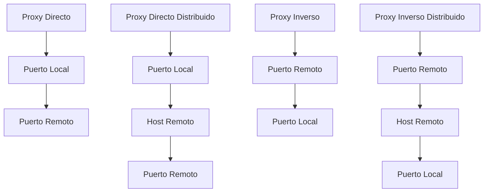

Proxy directo: Esto te permite reenviar conexiones de un puerto local a un puerto remoto.

```
Sintaxis: VegaExpressProxy ] localPort - remoteHost:remotePort

Ejemplo: VegaExpressProxy ] 8080 - example.com:80
```

Proxy directo distribuido: Esto te permite reenviar conexiones de un puerto local a un puerto remoto, pero el reenvío se realiza en un host remoto.

```
Sintaxis: VegaExpressProxy ] localPort - remoteHost:remotePort @ fusionHost:fusionPort

Ejemplo: VegaExpressProxy ] 8080 - example.com:80 @ fusion.example.com:9000
```

Proxy inverso: Esto te permite reenviar conexiones de un puerto remoto a un puerto local.

```
Sintaxis: VegaExpressProxy localPort [ - remoteHost:remotePort ]

Ejemplo: VegaExpressProxy 8080 - example.com:80
```

Proxy inverso distribuido: Esto te permite reenviar conexiones de un puerto remoto a un puerto local, pero el reenvío se realiza en un host remoto.

```
Sintaxis: VegaExpressProxy localPort [ - remoteHost:remotePort ] @ fusionHost:fusionPort

Ejemplo: VegaExpressProxy 8080 - example.com:80 @ fusion.example.com:9000
```

